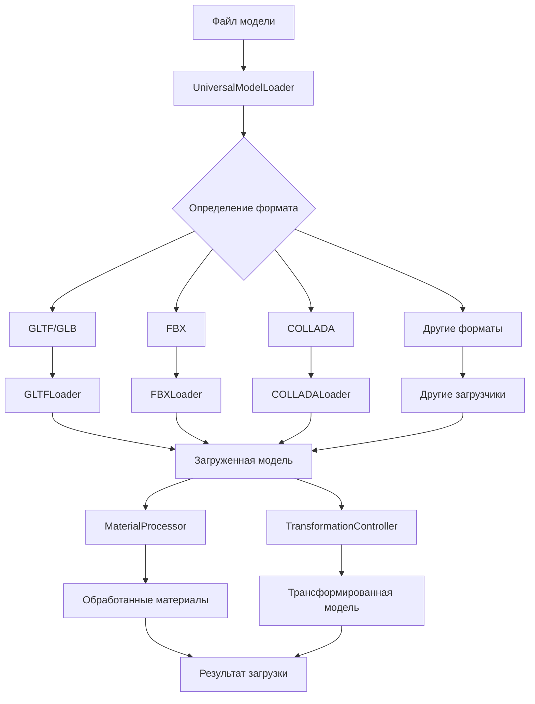

# Новая архитектура системы загрузки 3D-моделей для Pepakura Next

## Обзор

Этот документ описывает архитектуру новой системы загрузки 3D-моделей для приложения Pepakura Next. Новая система обеспечивает поддержку широкого спектра форматов 3D-моделей с расширенной обработкой материалов и текстур, включая PBR.

## Требования

1. Поддержка форматов:
   - GLTF/GLB
   - FBX
   - COLLADA (DAE)
   - OBJ
   - STL
   - 3DS

2. Обработка материалов и текстур:
   - Поддержка PBR (Physically Based Rendering)
   - Работа с картами нормалей, шероховатости, металличности
   - Совместимость с текущими текстурами

3. Базовые операции:
   - Масштабирование
   - Поворот
   - Перемещение

## Архитектура

### Компоненты системы

1. **UniversalModelLoader** - основной класс для загрузки моделей
2. **FormatLoaders** - набор загрузчиков для каждого формата
3. **MaterialProcessor** - обработчик материалов и текстур
4. **TransformationController** - контроллер трансформаций модели

### Структура классов

```typescript
// Интерфейс для результата загрузки
interface LoadResult {
  object: THREE.Object3D;
  materials?: MaterialData[];
}

// Интерфейс для данных материала
interface MaterialData {
  name: string;
  type: string;
  properties: MaterialProperties;
  textures: TextureData[];
}

// Интерфейс для текстур
interface TextureData {
  type: 'baseColor' | 'normal' | 'roughness' | 'metalness' | 'emissive';
  url: string;
  data?: ArrayBuffer;
}

// Интерфейс для свойств материала
interface MaterialProperties {
  baseColor?: [number, number, number];
  roughness?: number;
  metalness?: number;
  // Другие свойства PBR
}

// Основной класс загрузчика
class UniversalModelLoader {
  async load(file: File): Promise<LoadResult> {
    // Определение формата файла
    const format = this.detectFormat(file);
    
    // Выбор соответствующего загрузчика
    const loader = this.getLoader(format);
    
    // Загрузка модели
    const result = await loader.load(file);
    
    // Обработка материалов
    const processedMaterials = await this.processMaterials(result.materials);
    
    // Применение трансформаций
    this.applyDefaultTransform(result.object);
    
    return {
      object: result.object,
      materials: processedMaterials
    };
  }
  
  private detectFormat(file: File): string {
    // Логика определения формата файла
  }
  
  private getLoader(format: string): FormatLoader {
    // Возвращает соответствующий загрузчик для формата
  }
  
  private async processMaterials(materials: any[]): Promise<MaterialData[]> {
    // Обработка материалов с поддержкой PBR
  }
  
  private applyDefaultTransform(object: THREE.Object3D): void {
    // Применение базовых трансформаций
  }
}

// Абстрактный класс для загрузчиков форматов
abstract class FormatLoader {
  abstract load(file: File): Promise<LoadResult>;
}

// Конкретные реализации загрузчиков
class GLTFLoader extends FormatLoader {
  async load(file: File): Promise<LoadResult> {
    // Реализация загрузки GLTF/GLB
  }
}

class FBXLoader extends FormatLoader {
  async load(file: File): Promise<LoadResult> {
    // Реализация загрузки FBX
  }
}

class COLLADALoader extends FormatLoader {
  async load(file: File): Promise<LoadResult> {
    // Реализация загрузки COLLADA (DAE)
  }
}

// Другие загрузчики форматов...

// Класс для обработки материалов
class MaterialProcessor {
  async process(materials: any[]): Promise<MaterialData[]> {
    // Обработка материалов с поддержкой PBR
  }
  
  private processPBRMaterial(material: any): MaterialData {
    // Обработка PBR материала
  }
  
  private processTexture(texture: any): TextureData {
    // Обработка текстуры
  }
}

// Класс для управления трансформациями
class TransformationController {
  scale(object: THREE.Object3D, factor: number): void {
    // Масштабирование объекта
  }
  
  rotate(object: THREE.Object3D, axis: string, angle: number): void {
    // Поворот объекта
  }
  
  translate(object: THREE.Object3D, x: number, y: number, z: number): void {
    // Перемещение объекта
  }
}
```

### Поток данных



## Интеграция с существующей кодовой базой

1. Заменить существующий `UniversalModelLoader` новой реализацией
2. Обновить зависимости в `package.json` для поддержки новых форматов
3. Добавить новые загрузчики в сборку приложения
4. Обновить компоненты пользовательского интерфейса для работы с новой системой

## План реализации

1. Создать структуру классов и интерфейсов
2. Реализовать загрузчики для каждого формата
3. Разработать обработчик материалов и текстур
4. Добавить поддержку трансформаций
5. Интегрировать новую систему в приложение
6. Провести тестирование с различными форматами моделей
7. Подготовить документацию

## Заключение

Новая архитектура системы загрузки 3D-моделей обеспечивает расширенную поддержку форматов и материалов, а также базовые операции трансформации. Это создает прочную основу для дальнейшего развития функциональности приложения Pepakura Next.